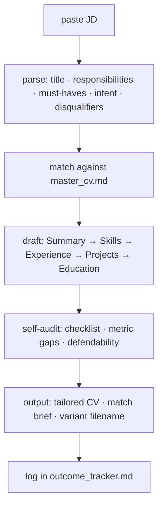

# ATS-Sniper
Claude-powered CV tailoring system. Paste a JD, get a role-calibrated CV variant drawn from a verified master file. Includes ATS mechanics, JD intent classifier, defendability checks, and outcome tracker.

# This project was inspired by @saberdevv from a viral Reddit post, so this tool only exists because he shared a lot of insisghts.
https://www.reddit.com/r/jobhunting/comments/1od54yj/followup_feedback_and_your_answers_14_months/?utm_source=share&utm_medium=web3x&utm_name=web3xcss&utm_term=1&utm_content=share_button

## what it is

A personal Claude Project that replaces the "rewrite my CV from scratch every time" grind with a structured, repeatable system. You maintain one ground-truth master file; the project produces tailored CV variants calibrated to each job description — no invented skills, no keyword walls, no claims you can't defend in an interview.

Built on the principle: **translate real past work into the JD's language. Never invent.**

---

## how it works

## files

| file | purpose |
|------|---------|
| `project_instructions.md` | paste into Claude Project custom instructions |
| `master_cv.md` | ground truth: every verified role, skill, metric, anti-claim |
| `methodology.md` | full SOP: JD intake, intent classifier, ATS mechanics, section rules, self-audit |
| `outcome_tracker.md` | application log + pattern analysis |

---

## setup aka how to get started TODAY 🫡

1. Create a new [Claude Project](https://claude.ai) and name it `CV Modifier`
2. Copy the contents of `project_instructions.md` into the project's **Custom instructions** field
3. Upload `master_cv.md`, `methodology.md`, and `outcome_tracker.md` as project knowledge
4. Fork and update `master_cv.md` with your own verified experience

Open a new chat in the project, paste a JD, get a tailored CV.

---

## key concepts

**ground truth master file** — one file stores every verified role, project, skill with proficiency level, metric with source, and an anti-claims list. tailored CVs are projections of this file, never extensions of it.

**translation–invention line** — translating real experience into the JD's language is legitimate. claiming skills you can't defend live in an interview is not. the system enforces this distinction on every run.

**JD intent classifier** — every JD gets tagged with a primary intent (throughput, reliability, GTM, BD, builder/shipping, cost, stakeholder). bullets are prioritized to match.

**metric gap flag** — bullets without quantifiers are marked `[needs metric]` inline rather than silently dropped or padded. fill the number or rewrite the bullet.

**outcome tracker** — logs each application with lane, intent, variant, and result. after ~20-30 entries, patterns emerge on what actually converts.

---

## stack

Claude Projects · Claude Sonnet · Markdown
